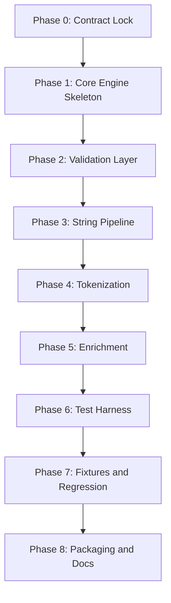

# Key Normalizer Development Plan

## Objective

Deliver a deterministic, dependency-free normalization library and a single-page browser test harness based on the hardened v2.1 specification.

Primary deliverables:

- `keyNormalizer.js`: one self-contained JavaScript file with no runtime dependencies
- `index.html`: one self-contained single-page test harness that loads `keyNormalizer.js` directly in the browser

The intended distribution model is similar to tools like Mermaid or D3 in spirit:

- easy to drop into any project
- usable directly from a `<script>` tag
- no package manager required
- no build step required for consumers

## Product Shape

### Library Deliverable

`keyNormalizer.js` should expose a compact public API suitable for both browser and Node.js use without dependencies.

Initial target API:

```js
const result = KeyNormalizer.normalize(task);
```

Optional expanded API:

```js
const validator = KeyNormalizer.validateTask(task);
const result = KeyNormalizer.normalize(task);
const tokens = KeyNormalizer.extractTokens(task);
const version = KeyNormalizer.version;
```

Distribution expectations:

- browser global: `window.KeyNormalizer`
- Node-friendly export fallback if `module.exports` exists
- pure ECMAScript 2023-compatible implementation

### Test Harness Deliverable

`index.html` should provide a focused playground for:

- entering or pasting a `NormalizationTask` JSON payload
- running normalization in-browser with no network access
- viewing the normalized string, tokens, metadata, and warnings
- loading curated example tasks
- comparing expected vs actual output for regression testing

## Guiding Constraints

- no dependencies
- no network calls
- no build tooling required for consumers
- deterministic behavior across conforming ECMAScript 2023 runtimes
- implementation must follow the v2.1 execution and failure model exactly

## Proposed File Layout

```text
/Deterministic-Key-Normalization-Pipeline-v2.1.md
/Key-Normalizer-Development-Plan.md
/keyNormalizer.js
/index.html
/examples/
  basic-task.json
  acronym-task.json
  degraded-enrichment-task.json
  invalid-duplicate-order-task.json
```

The `examples/` folder is optional for distribution, but useful during development. If we want a stricter "two-file only" release artifact, examples can later be folded into `index.html`.

## Architecture Plan

The implementation should be organized internally as small pure functions inside a single file, not as separate modules.

Suggested internal layers:

1. `normalizeStringsToNfc`
2. `validateTask`
3. `sortAndValidateRules`
4. `applyRegexRules`
5. `tokenizeCanonical`
6. `applyEnrichmentRules`
7. `buildSuccessResult`
8. `buildFailedResult`

This keeps the shipping artifact to one file while still preserving maintainability.

## Phased Plan

## Phase 0: Contract Lock

Goal:
Freeze the implementation contract before coding so library and harness behavior stay aligned.

Tasks:

- confirm the v2.1 spec is the source of truth
- decide whether acronym-boundary handling becomes part of the canonical sample pipeline or remains user-defined
- lock the public API for `keyNormalizer.js`
- define the minimum supported browser baseline
- decide whether example fixtures ship as separate files or inline in `index.html`

Outputs:

- finalized API surface
- finalized example set
- implementation checklist derived from the spec

Acceptance criteria:

- no unresolved ambiguity around task validation, warning shape, or failure behavior
- one agreed distribution story for browser and Node.js

## Phase 1: Core Engine Skeleton

Goal:
Create the minimal self-contained engine shape and public entry points.

Tasks:

- create `keyNormalizer.js`
- wrap implementation in a universal no-dependency distribution pattern
- expose `KeyNormalizer.normalize(task)`
- expose `KeyNormalizer.validateTask(task)`
- add version metadata
- stub internal pure functions with clear call flow

Outputs:

- loadable library file in browser and Node.js
- stable public API shell

Acceptance criteria:

- opening `index.html` can call the library without any tooling
- requiring or importing the file in Node.js works through a simple compatibility wrapper

## Phase 2: Spec-Faithful Validation Layer

Goal:
Implement strict pre-execution validation exactly as defined in v2.1.

Tasks:

- validate task shape
- validate pipeline presence
- validate canonical phase names
- validate integer `order`
- detect duplicate `order`
- validate rule-kind-specific required fields
- validate regex compilation
- validate `DictionaryExpand` input object shape
- validate `missingInputBehavior`

Outputs:

- deterministic validation result model
- failed-result generation for invalid tasks

Acceptance criteria:

- invalid tasks never partially execute
- failure results match the spec shape
- validation is pure and side-effect free

## Phase 3: String Pipeline Execution

Goal:
Implement deterministic string-phase rule execution.

Tasks:

- NFC-normalize all execution-relevant strings
- sort rules by ascending unique `order`
- enforce that all `Enrichment` rules occur after all string rules
- apply `RegexReplace` rules in order
- preserve deterministic ECMAScript replacement behavior
- maintain working string state for output

Outputs:

- working string execution engine

Acceptance criteria:

- the same task produces the same normalized string across conforming runtimes
- regex compilation or execution errors cannot leak partial results

## Phase 4: Canonical Tokenization

Goal:
Implement the exact tokenization contract from v2.1.

Tasks:

- split on `/[\p{Z}\p{P}]+/u`
- remove empty tokens
- lowercase using locale-independent ECMAScript behavior
- confirm digits remain unless removed earlier
- confirm punctuation is delimiter-only, not content-retained

Outputs:

- deterministic token array generation

Acceptance criteria:

- snake case, kebab case, punctuation-delimited identifiers, and basic camel case examples tokenize correctly
- tokenization adds no extra heuristics beyond the spec

## Phase 5: Enrichment and Degraded Execution

Goal:
Support optional dictionary-backed enrichment without violating offline determinism.

Tasks:

- implement `DictionaryExpand`
- perform exact token lookup against task-local dictionaries
- tokenize replacement values canonically before splicing
- implement `skipWithWarning`
- implement `fail`
- append warnings in canonical object shape

Outputs:

- enrichment pipeline
- degraded execution support

Acceptance criteria:

- missing optional inputs produce warnings, not crashes
- missing required inputs fail deterministically
- enrichment never mutates original task payload objects

## Phase 6: Single-Page Test Harness

Goal:
Create a one-file local testing UI for developers and stakeholders.

Tasks:

- create `index.html`
- embed lightweight CSS and minimal UI logic
- load `keyNormalizer.js` via local script tag
- add text area for task JSON input
- add "Run Normalize" action
- add result panels for normalized string, tokens, warnings, and full JSON output
- add example picker
- add pass/fail comparison view for expected outputs
- add copy buttons for task and result JSON

Outputs:

- openable local HTML page with no server requirement

Acceptance criteria:

- double-clicking or opening the HTML file locally works
- all examples can be run without internet access
- output panels clearly surface validation failures vs degraded execution warnings

## Phase 7: Fixture Suite and Regression Coverage

Goal:
Build confidence in the deterministic contract with representative examples.

Tasks:

- create happy-path fixtures
- create invalid-pipeline fixtures
- create degraded-enrichment fixtures
- create Unicode normalization fixtures
- create case-style fixtures:
  `snake_case`, `kebab-case`, `camelCase`, `PascalCase`, `WikiWords`, acronym-heavy forms like `getURLData`
- document expected tokens and warnings for each

Outputs:

- reusable fixture corpus for manual and automated verification

Acceptance criteria:

- every spec rule has at least one positive and one negative test case where applicable
- acronym behavior is explicitly documented, even if left pipeline-configurable

## Phase 8: Packaging and Consumer Documentation

Goal:
Make adoption easy for downstream users.

Tasks:

- add usage examples for browser global usage
- add usage examples for Node.js usage
- document public API
- document error and warning semantics
- document supported task schema
- document "no dependencies, no network, no build step" guarantees

Outputs:

- README-style usage guidance, either as a separate doc or embedded near the top of `keyNormalizer.js`

Acceptance criteria:

- a consumer can integrate the library in under five minutes
- a consumer can understand how to supply custom pipelines and dictionaries without reading implementation code

## Recommended Build Order



## Milestone Definition

### Milestone A: Engine Alpha

Includes:

- Phases 1 through 4

Meaning:

- we can validate tasks
- execute regex rules
- tokenize deterministically
- inspect results programmatically

### Milestone B: Offline Feature Complete

Includes:

- Phases 1 through 6

Meaning:

- the engine supports degraded enrichment
- the single-page tester works locally
- stakeholders can exercise the spec without tooling

### Milestone C: Release Candidate

Includes:

- Phases 1 through 8

Meaning:

- fixtures, documentation, and packaging are ready for other teams to consume

## Risks and Mitigations

### Risk: Cross-runtime regex edge cases

Mitigation:

- validate against the ECMAScript 2023 baseline only
- avoid implementation shortcuts beyond standard `RegExp`
- include fixtures with Unicode punctuation and mixed normalization forms

### Risk: Scope creep in rule kinds

Mitigation:

- ship only `RegexReplace` and `DictionaryExpand` initially
- treat new rule kinds as future spec versions, not ad hoc additions

### Risk: Browser and Node.js packaging drift

Mitigation:

- keep one source file and one distribution file
- test both `window.KeyNormalizer` and Node export paths from the same artifact

### Risk: The tester becomes more complex than the library

Mitigation:

- keep the HTML harness focused on inspection and fixtures
- do not add framework-like UI abstractions

## Definition of Done

The project is done for this phase plan when:

- `keyNormalizer.js` is a single dependency-free artifact usable in browser and Node.js
- `index.html` is a single dependency-free local tester
- both artifacts work fully offline
- the implementation conforms to the v2.1 spec
- fixtures cover the supported naming conventions and degraded execution paths
- consumers can use the library without build tools or package installation

## Recommended Next Step

Start with Phases 1 through 3 in one implementation pass, then immediately wire a minimal `index.html` smoke test before expanding fixtures. That keeps the core engine honest early and prevents the UI from drifting away from the real execution model.
